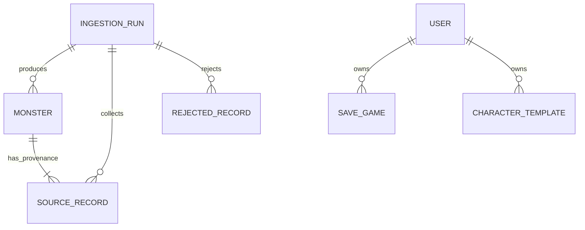

# Block 1 conceptual and logical data models

## Conceptual data model (MCD)



At the conceptual level, a run collects zero or more source records. Accepted
records contribute to one canonical monster; rejected records retain a reason
but do not become monsters. A user owns personal save games and character
templates. Public monster data has no relationship to a user.

## Logical data model (MLD)

```text
INGESTION_RUN(
  #id, started_at, completed_at, collected_count, accepted_count,
  rejected_count, merged_count, conflict_count, manifest_json
)

MONSTER(
  #id, stable_key[U], name[U], armor, HP, challenge_rating,
  challenge_rating_raw, strength, dexterity, constitution, intelligence,
  wisdom, charisma, description, gold_loot_min, gold_loot_max, items_loot,
  ingestion_run_id => INGESTION_RUN.id
)

MONSTER_SOURCE(
  #id, monster_id => MONSTER.id,
  ingestion_run_id => INGESTION_RUN.id,
  source, source_record_id, source_url, collected_at, selected,
  UNIQUE(ingestion_run_id, source, source_record_id)
)

REJECTED_RECORD(
  #id, ingestion_run_id => INGESTION_RUN.id,
  source, source_record_id, reason_code, message, payload_json
)

USER(#id, username[U], email, password_hash, dates...)
SAVE_GAME(#id, user_id => USER.id, adventure data, state, dates...)
CHARACTER_TEMPLATE(#id, user_id => USER.id, fictional attributes, dates...)
```

`[U]` denotes a uniqueness constraint and `=>` a foreign key. The Django MLD
is managed by migrations; the dataset physical schema is created by
`src/data_pipeline/storage.py`.
