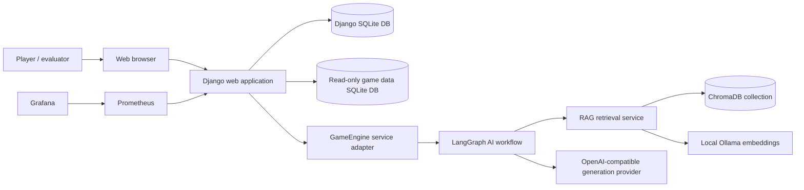
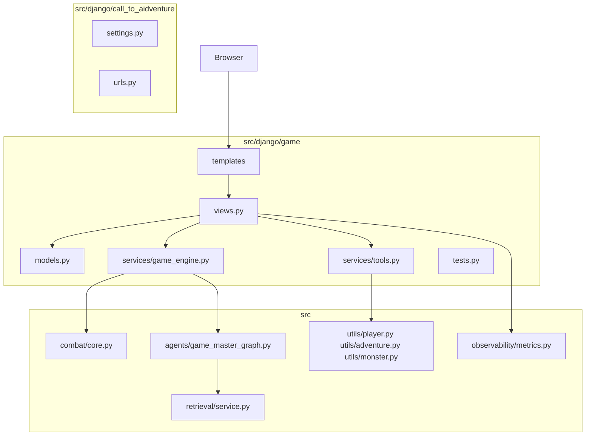
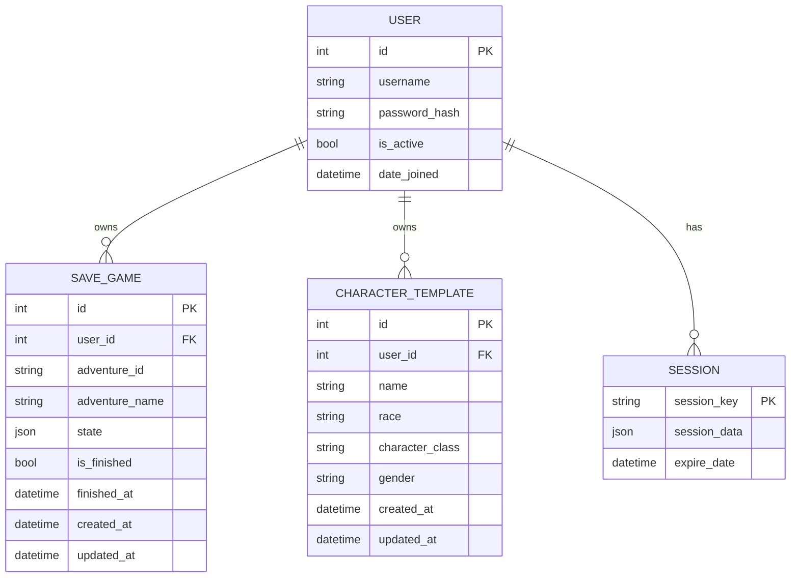
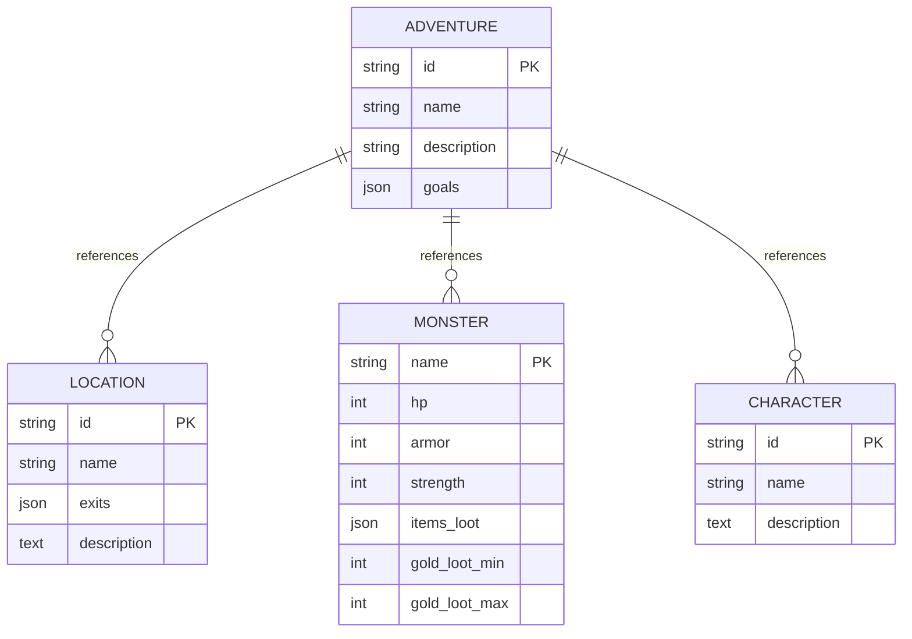
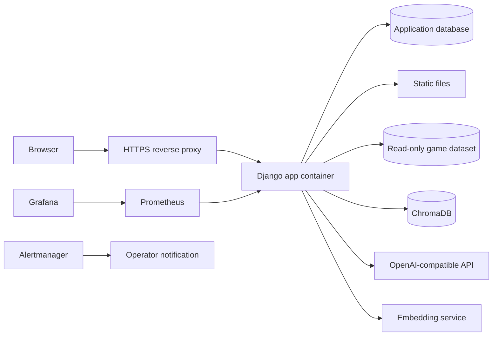

# Block 3 technical framework models

## Architecture scope

The active application is a Django web app integrating an AI game-master
workflow. Django owns user-facing pages, sessions, authentication and JSON
endpoints. `GameEngine` owns the boundary to LangGraph and deterministic
combat. Retrieval and LLM provider calls are internal services behind the graph.

Legacy Gradio files are not part of the active browser production surface.

## C4 context

## Container/component model

## Data ownership

| Data | Owner module | Storage | Lifecycle |
|---|---|---|---|
| Django users | `django.contrib.auth` | Django DB | Created by signup/admin, deleted by user/admin tooling |
| Sessions | Django session framework | Django DB by default | Created per browser session, expires by Django settings |
| Active anonymous game state | `game.services.tools.persist_game` | Session only | Lost when session expires/clears |
| Authenticated save state | `SaveGame` | Django DB JSON field | Created on new game, updated on turn, marked finished on ending |
| Character templates | `CharacterTemplate` | Django DB | Created/updated/deleted by owner; generic templates seeded |
| Adventure metadata | `utils.adventure` | Read-only dataset DB/files | Loaded at runtime; changed by data pipeline |
| Monster data | `utils.monster` | Read-only dataset DB | Loaded at combat start |
| RAG chunks | `retrieval` | ChromaDB collection | Built/updated by ingest process |
| Metrics | `observability.metrics` | Prometheus scrape store | Retained by Prometheus config |

## Entity relationship model

External read-only data is intentionally modeled separately from the Django DB:

## Target deployment model

## Environment matrix

| Concern | Development | Test/CI | Target deployment |
|---|---|---|---|
| `DJANGO_DEBUG` | `true` | `false` where deploy checks run | `false` |
| `DJANGO_SECRET_KEY` | Optional dev fallback | Required test value | Required secret manager value |
| `DJANGO_ALLOWED_HOSTS` | localhost defaults | explicit test host | production domains |
| Database | SQLite local | SQLite disposable | selected managed DB or mounted SQLite only for demo |
| Static files | Django dev server | collected/built artifact | served by app/proxy/object storage |
| AI key | optional for mocked tests | secret only for live eval | secret manager/env |
| Rate limit cache | local memory | local memory | shared Redis-equivalent recommended |
| Monitoring | local compose | rule validation | secured Prometheus/Grafana/alerts |

## External service/data flows

| Flow | Source | Destination | Data sent | Control |
|---|---|---|---|---|
| Story generation | LangGraph | OpenAI-compatible provider | Current story state, selected choice, scoped RAG context | Timeout, retries, rate limit, no credentials in payload |
| Embedding | Retrieval ingest/query | Ollama | Lore/query text | Local service in current design |
| Vector retrieval | Retrieval service | ChromaDB | Embeddings and metadata filters | Adventure/location scoping |
| Metrics scrape | Prometheus | Django `/metrics` | Aggregated counters/histograms | Avoid PII labels |
| Browser JSON | Browser | Django views | Choices/actions/template/save commands | CSRF, session auth, body limits |

## Proof-of-concept success criteria

| Criterion | Status | Evidence |
|---|---|---|
| A user can complete a web-based adventure loop | Pass | Django pages and tests |
| AI-generated narrative can be combined with deterministic rules | Pass | LangGraph + combat integration |
| RAG limits lore to selected adventure/location | Pass | Retrieval tests and docs |
| Provider outage does not corrupt saved state | Pass | Regression tests |
| Authenticated saves are isolated by owner | Pass | Save/template authorization tests |
| Combat is safe for concurrent session states | Pass after Priority 1 | `CombatSession` and isolation test |
| Production settings can be validated by environment | Pass after Priority 1 | `check --deploy` with non-debug env |
| CI/CD and staged deployment are industrialized | Planned | Priority 4 |
| Alerting and incident runbooks are complete | Planned | Priority 5 |
